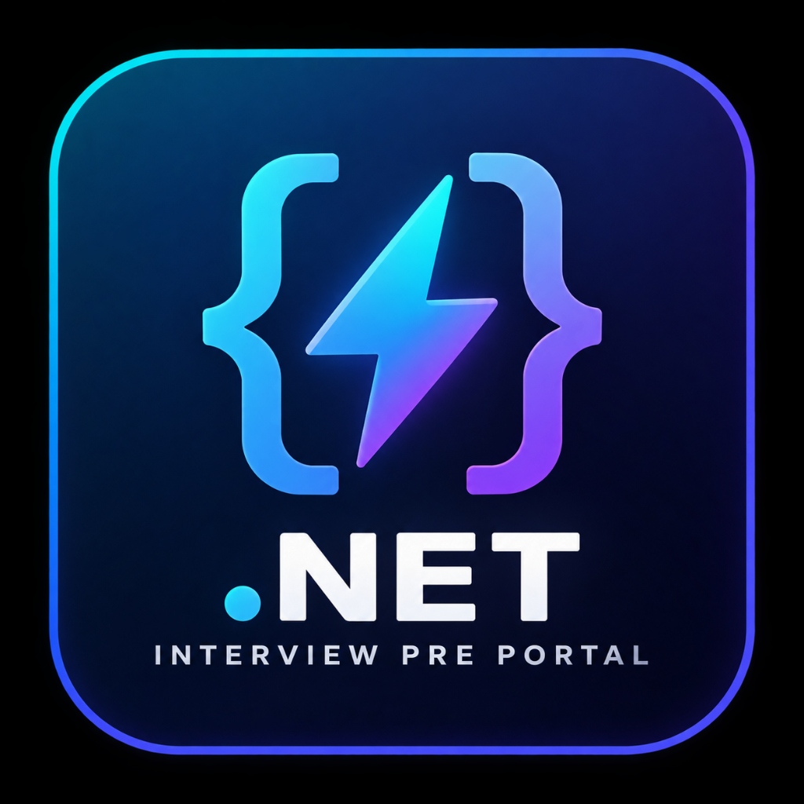

# Senior Full-Stack .NET Developer (7+ Years) Interview Preparation Portal

<p align="center">
  
</p>

<p align="center">
  <strong>An all-in-one, offline-ready interactive portal packed with 2,699+ real-world interview questions, architectural scenarios, coding exercises, and active-recall flashcards curated for senior-level engineering roles.</strong>
</p>

<p align="center">
  <a href="https://nitin048.github.io/interviewPrep/senior-dotnet-interview-portal.html">
    
  </a>
</p>

<p align="center">
  
  
  
  
  
</p>

---

## 🚀 Overview

The **Senior Full-Stack .NET Developer Interview Preparation Portal** is a production-grade, standalone web application engineered to accelerate interview preparation for Senior, Lead, and Principal .NET/Full-Stack Software Engineers.

Everything is packed into a **single, portable, zero-dependency HTML file** (`senior-dotnet-interview-portal.html`), enabling full offline study without requiring Node.js, databases, or cloud servers.

---

## 🎯 Key Features

### 1. 🔍 Comprehensive Question Explorer
- **2,699 curated questions** spanning backend, frontend, architecture, databases, algorithms, and AI.
- **Real-time fuzzy search** across question titles, comprehensive explanations, architectural rationale, and code blocks.
- **Multi-dimensional filtering**:
  - **Category**: 25+ specialized domains.
  - **Difficulty**: Beginner, Intermediate, Advanced, and Expert.
  - **Question Type**: Conceptual, Architectural, Coding & Algos, Scenario-based, Comparisons, and Troubleshooting.

### 2. ⏱️ Mock Interview Simulator
- Practice under real interview pressure with timed rounds.
- Configure question counts, specific categories, and difficulty levels.
- Evaluate your performance with instant review tools and answers.

### 3. 🃏 3D Interactive Flashcards
- Smooth 3D card-flip animations designed for rapid active-recall revision.
- Cycle through high-yield concepts in C#, async internals, SQL query tuning, and system design patterns.

### 4. 📊 Personal Mastery & Revision Hub
- Mark questions as **✅ Mastered**, **🔄 Needs Revision**, or **⭐ Bookmarked**.
- All progress, notes, and mastery metrics are automatically persisted to browser `localStorage`.
- Real-time progress bar tracking your path toward 100% readiness.

### 5. 🖨️ Printable Study Guide & Cheat Sheet
- One-click print-optimized view for creating hardcopy study guides or exporting to clean PDFs.
- Includes quick-reference tables, syntax summaries, and architectural diagrams.

### 6. 🌗 Premium Theme Support
- Deep Dark Mode and Clean Light Mode built with custom CSS design tokens and smooth transitions.

---

## 📚 Curriculum & Question Matrix

| Domain / Category | Question Count | Core Focus Areas |
|---|:---:|---|
| **JavaScript & Modern ES6+ / TypeScript** | 325+ | Typing system, Generics, Event Loop, Closures, Prototypal Inheritance, Strict Mode |
| **React.js & Frontend Ecosystem** | 335+ | React 18/19, Virtual DOM, Fiber, Custom Hooks, Performance, Server Components |
| **State Management & Redux** | 215+ | Redux Toolkit (RTK), Thunks, Saga, Immer, Selector Memoization, Context API |
| **AI & Machine Learning in .NET** | 283 | Semantic Kernel, OpenAI/Azure AI SDKs, LLM Guardrails, Prompt Engineering, RAG |
| **Data Structures, Algorithms & Coding** | 248 | Time/Space Complexity, Trees, Graphs, Dynamic Programming, C# LeetCode Patterns |
| **C#, .NET Core & Modern Runtime** | 198 | CLR internals, Memory management, GC Generations, Span&lt;T&gt;, ValueTasks |
| **OOP, SOLID & Design Patterns** | 166 | Gang of Four (GoF), Domain-Driven Design (DDD), Clean Architecture, Refactoring |
| **ASP.NET Core (Web API & MVC)** | 147 | Pipeline, Middleware, Filters, Dependency Injection lifetimes, Minimal APIs |
| **Relational Databases & SQL Server** | 141 | Indexing (B-Tree), Execution Plans, Isolation Levels, Transactions, Query Tuning |
| **Entity Framework Core** | 92 | Change Tracker, AsNoTracking, Compiled Queries, Migration strategies, N+1 |
| **Testing, QA & Automation** | 96 | xUnit, NUnit, Moq, Testcontainers, TDD/BDD, Integration Testing |
| **Performance, Memory & Profiling** | 83 | BenchmarkDotNet, dotnet-dump, ArrayPool, Memory Leaks, Low Allocation |
| **Cloud (Azure & AWS)** | 105 | Serverless, Azure Functions, Lambda, Event-Driven Architecture, Messaging |
| **System Design (HLD & LLD)** | 35+ | Microservices, CQRS, Event Sourcing, CAP Theorem, Sharding, Resiliency |
| **Security, OAuth & OWASP** | 32 | JWT, OAuth2/OIDC, Data Protection API, CSRF, XSS, Secret Management |
| **Async, Concurrency & Multithreading** | 87 | Task Parallel Library (TPL), Synchronization Primitives, Channel&lt;T&gt; |

---

## ⚡ Quick Start

### 🌐 Live Online Demo (GitHub Pages)
Launch the portal immediately without downloading anything:
👉 **[https://nitin048.github.io/interviewPrep/senior-dotnet-interview-portal.html](https://nitin048.github.io/interviewPrep/senior-dotnet-interview-portal.html)**  
*(or visit root: **[https://nitin048.github.io/interviewPrep/](https://nitin048.github.io/interviewPrep/)**)*

---

### Option A: Local Direct Open (Offline)
No installations, build steps, or package managers are required! Simply double-click or open [`senior-dotnet-interview-portal.html`](senior-dotnet-interview-portal.html) in any modern web browser (Google Chrome, Microsoft Edge, Mozilla Firefox, Safari, Brave).

```bash
# macOS
open senior-dotnet-interview-portal.html

# Linux
xdg-open senior-dotnet-interview-portal.html

# Windows
start senior-dotnet-interview-portal.html
```

### Option B: Local Static Server (Optional)
If you prefer running through a local development server:

```bash
# Using Python
python3 -m http.server 8080

# Using Node.js npx
npx serve .
```
Then visit `http://localhost:8080/senior-dotnet-interview-portal.html` in your browser.

---

## 📁 Repository Structure

```
interviewPrep/
│
├── dotnet-interview-brand-icon.jpg      # Official portal brand icon / logo
├── senior-dotnet-interview-portal.html   # Standalone interactive preparation portal (2,699+ questions)
└── README.md                            # Comprehensive project documentation
```

---

## 💡 Recommended Preparation Strategy

1. **Self-Assessment (Explorer)**: Filter by **Advanced** & **Expert** in your primary domain (.NET Core, ASP.NET, or React) to identify weak spots.
2. **Deep Dive (Flashcards)**: Spend 15 minutes daily flipping through the 3D Flashcards for rapid concept retention.
3. **Simulation (Mock Mode)**: Run a timed 10-question mock session covering System Design, Performance, and Troubleshooting.
4. **Final Revision (Printable Guide)**: Generate the condensed cheat sheet 24 hours before your technical interview.

---

## 🤝 Contributing & Feedback

Suggestions for new questions, architectural diagrams, or corrections are welcome! Feel free to open an issue or submit a pull request.

---

## 📄 License

This repository is licensed under the [MIT License](LICENSE).